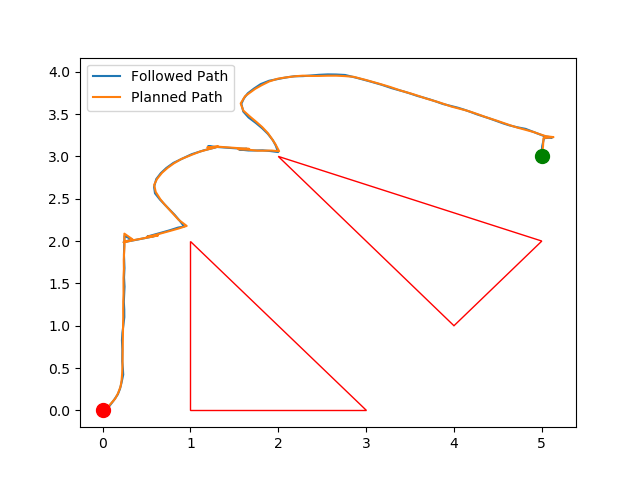

## Instructions to run the code

Ensure doing the following before running the code.

```shell
cd ~/catkin_ws/src
git clone https://github.com/SDeepakMallya/sc627_helper.git
git clone https://github.com/TheSmilingSky/sc627_assignments.git
cd ..
catkin_make
source devel/setup.bash
cd src/sc627_assignments/assignment_2
chmod +x potential_function_planner.py
cd ../../sc627_helper
chmod +x move_xy_server.py
``` 

In four parallel terminals, run the following to visualize the algorithm simulation.

```shell
roscore
roslaunch turtlebot3_gazebo turtlebot3_empty_world.launch
rosrun sc627_helper move_xy_server.py
rosrun sc627_assignments potential_function_planner.py
```

The generated results post simulations will be stored in the 'data' folder inside the assignment_2 folder.

A generated result visualization:

